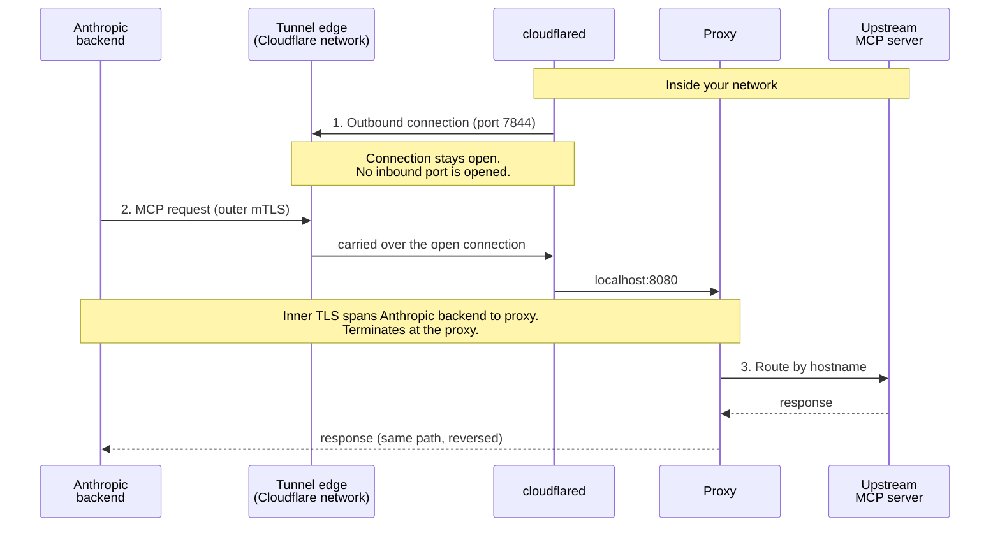

# Architecture and components

Canonical names for the parts of an MCP tunnel deployment, the two credential-provisioning modes, and the connection model.

---

<Note>
  MCP tunnels are in research preview. [Request access](https://claude.com/form/claude-managed-agents) to try them.
</Note>

This page defines the terms used throughout the [MCP tunnels](/docs/en/agents-and-tools/mcp-tunnels/overview) documentation. Several components appear under different names in configuration files, container images, and prose; the following tables give one canonical name for each and list the aliases you may encounter.

## Components

| Term                    | Definition                                                                                                                                                                                                                                                                                                              | Also appears as                                                                                                                                                                                  |
| ----------------------- | ----------------------------------------------------------------------------------------------------------------------------------------------------------------------------------------------------------------------------------------------------------------------------------------------------------------------- | ------------------------------------------------------------------------------------------------------------------------------------------------------------------------------------------------ |
| **Tunnel stack**        | The two containers you run inside your network to attach to a tunnel: the proxy and cloudflared. One stack serves one tunnel and can be replicated across hosts for availability. With programmatic access, the setup component runs alongside the stack to provision credentials.                                      | the stack, the MCP tunnel stack, the tunnel deployment, your deployment                                                                                                                          |
| **Proxy**               | Anthropic's routing component. Terminates inner TLS, validates that upstream IPs fall within an allowed range, and routes each request to an upstream MCP server based on hostname.                                                                                                                                     | `mcp-proxy` (image name, Compose service name, and Helm container name), `mcp-gateway` (container-internal config path `/etc/mcp-gateway/config.yaml` and Helm `gateway.config.*` values prefix) |
| **cloudflared**         | Cloudflare's open-source tunnel connector. Initiates the outbound-only connections from your network to the tunnel edge and carries encrypted traffic between the edge and the proxy. Not related to a Managed Agent.                                                                                                   | the outbound connector, the tunnel connector                                                                                                                                                     |
| **Setup component**     | The `setup` binary, shipped inside the `mcp-proxy` image. With programmatic access it authenticates over Workload Identity Federation, fetches the tunnel token, generates a CA and server certificate, and registers the CA with Anthropic. Also provides `renew-cert`.                                                | setup Job (the Helm pre-install hook), `setup` service (the Compose profile), setup hook, setup binary, setup CLI                                                                                |
| **Tunnel edge**         | The Cloudflare edge servers that cloudflared dials out to (IP ranges `198.41.192.0/19` and `2606:4700:a0::/44`, port 7844 TCP and UDP). The tunnel that runs over them is provisioned and controlled by Anthropic; Cloudflare operates the underlying network.                                                          | the edge, the Anthropic-operated tunnel edge                                                                                                                                                     |
| **Inner TLS**           | A second TLS handshake carried inside the tunnel's plaintext WebSocket stream, between Anthropic's backend and your proxy. The proxy presents a server certificate signed by a CA you registered on the tunnel. Because only you hold the private key, the transport provider cannot read request or response payloads. | the inner TLS handshake                                                                                                                                                                          |
| **Upstream MCP server** | An MCP server running in your private network that the proxy routes to. Each upstream is exposed as one subdomain under your tunnel domain.                                                                                                                                                                             | upstream, routed MCP server, tunneled MCP server                                                                                                                                                 |

## Credential provisioning

The tunnel stack needs two credentials at runtime: the **tunnel token**, which authenticates cloudflared's outbound connection, and a **server certificate** signed by a CA registered on the tunnel, which the proxy presents during the inner TLS handshake. There are two ways to supply them, presented throughout this guide as a pair of tabs.

| Mode                    | How credentials reach the stack                                                                                                                                                                                                                                                                                                                          | Helm chart name                                   | Tab label                       |
| ----------------------- | -------------------------------------------------------------------------------------------------------------------------------------------------------------------------------------------------------------------------------------------------------------------------------------------------------------------------------------------------------- | ------------------------------------------------- | ------------------------------- |
| **Programmatic access** | The setup component authenticates to the Tunnels API through [Workload Identity Federation](/docs/en/manage-claude/workload-identity-federation), fetches the tunnel token, generates a CA and server certificate locally, and registers the CA. No long-lived secret is copied by hand. Requires a federation rule with the `org:manage_tunnels` scope. | Managed mode (`setup.enabled: true`, the default) | **With programmatic access**    |
| **Manual**              | You copy the tunnel token from the Claude Console, generate a CA and server certificate yourself (for example with `openssl`), register the CA in the Console, and supply the token and certificate to the stack as secrets. No setup component runs.                                                                                                    | External mode (`setup.enabled: false`)            | **Without programmatic access** |

These modes are also referred to as **the programmatic flow** and **the manual flow** in the deploy guides.

## Connection model

Two directions are at work in a tunnel, and they point opposite ways:

* **Connection direction:** cloudflared dials **outbound** from your network to the tunnel edge. Your firewall sees only egress on port 7844; no inbound port is opened.
* **Request direction:** once that connection is established, MCP requests travel **from Anthropic toward your network** over it, through cloudflared to the proxy, and on to the upstream MCP server.

The phrase "outbound-only" describes the connection, not the requests carried over it.

Inner TLS spans Anthropic's backend and your proxy. cloudflared and the tunnel edge sit between them on the wire but see only ciphertext; the proxy is the first place inside your network where MCP request payloads are readable.

## See also

* [MCP tunnels](/docs/en/agents-and-tools/mcp-tunnels/overview) for the security model and shared-responsibility table.
* [MCP tunnels reference](/docs/en/agents-and-tools/mcp-tunnels/reference) for proxy configuration fields, certificate requirements, and the setup component.
