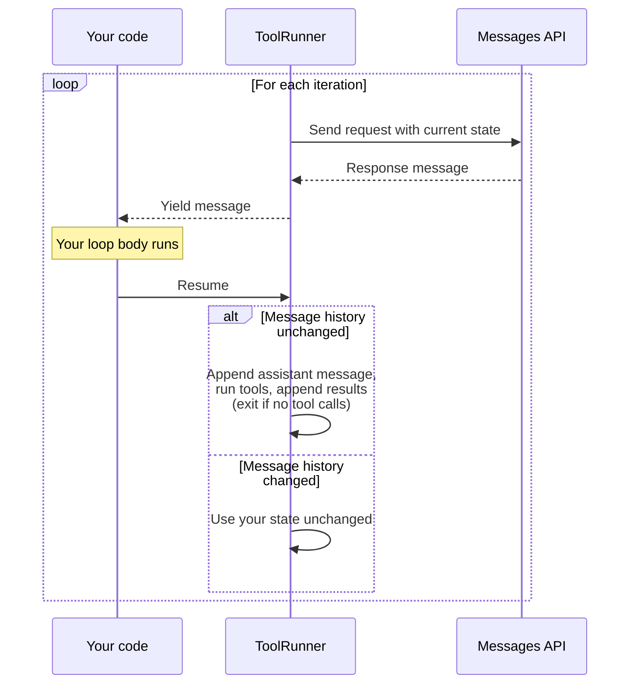

# Tool Runner (SDK)

Use the SDK's Tool Runner abstraction to handle the agentic loop, error wrapping, and type safety automatically.

---

Tool Runner handles the agentic loop, error wrapping, and type safety so you don't have to. When you need human-in-the-loop approval, custom logging, or conditional execution, use the [manual loop](/docs/en/agents-and-tools/tool-use/handle-tool-calls) instead.

The tool runner provides an out-of-the-box solution for running tools with Claude. The tool runner can simplify most tool use implementations. Instead of manually handling tool calls, tool results, and conversation management, the tool runner automatically:

* Runs tools when Claude calls them
* Handles the request/response cycle
* Manages conversation state
* Provides type safety and validation

<Note>
  The tool runner is currently in beta and available in the [Python SDK](https://github.com/anthropics/anthropic-sdk-python/blob/main/tools.md), [TypeScript SDK](https://github.com/anthropics/anthropic-sdk-typescript/blob/main/helpers.md#tool-helpers), [C# SDK](https://github.com/anthropics/anthropic-sdk-csharp/blob/main/examples/ToolRunnerExample/Program.cs), [Go SDK](https://github.com/anthropics/anthropic-sdk-go/blob/main/tools.md), [Java SDK](https://github.com/anthropics/anthropic-sdk-java/blob/main/anthropic-java-example/src/main/java/com/anthropic/example/BetaToolRunnerExample.java), [PHP SDK](https://github.com/anthropics/anthropic-sdk-php/blob/main/examples/beta/beta_tool_runner.php), and [Ruby SDK](https://github.com/anthropics/anthropic-sdk-ruby/blob/main/helpers.md#3-auto-looping-tool-runner-beta).
</Note>

## Basic usage

Define tools using the SDK helpers, then use the tool runner to run them.

<Tabs>
  <Tab title="Python">
    Use the `@beta_tool` decorator to define tools with type hints and docstrings.

    <Note>
      If you're using the async client, replace `@beta_tool` with `@beta_async_tool` and define the function with `async def`.
    </Note>

    ```python
    import json
    from anthropic import Anthropic, beta_tool

    client = Anthropic()


    @beta_tool
    def get_weather(location: str, unit: str = "fahrenheit") -> str:
        """Get the current weather in a given location.

        Args:
            location: The city and state, e.g. San Francisco, CA
            unit: Temperature unit, either 'celsius' or 'fahrenheit'
        """
        return json.dumps({"temperature": "20°C", "condition": "Sunny"})


    @beta_tool
    def calculate_sum(a: int, b: int) -> str:
        """Add two numbers together.

        Args:
            a: First number
            b: Second number
        """
        return str(a + b)


    runner = client.beta.messages.tool_runner(
        model="claude-opus-4-8",
        max_tokens=1024,
        tools=[get_weather, calculate_sum],
        messages=[
            {
                "role": "user",
                "content": "What's the weather like in Paris? Also, what's 15 + 27?",
            }
        ],
    )
    for message in runner:
        print(message)
    ```

    The `@beta_tool` decorator inspects the function arguments and docstring to derive the JSON schema for you.
  </Tab>

  <Tab title="TypeScript">
    Use `betaZodTool()` for type-safe tool definitions with Zod validation, or `betaTool()` for JSON Schema-based definitions.

    TypeScript offers two approaches for defining tools:

    **Using Zod (recommended)** - Use `betaZodTool()` for type-safe tool definitions with Zod validation (requires Zod 3.25.0 or higher):

    ```typescript
    import { betaZodTool } from "@anthropic-ai/sdk/helpers/beta/zod";
    import { z } from "zod";

    const client = new Anthropic();

    const getWeatherTool = betaZodTool({
      name: "get_weather",
      description: "Get the current weather in a given location",
      inputSchema: z.object({
        location: z.string().describe("The city and state, e.g. San Francisco, CA"),
        unit: z.enum(["celsius", "fahrenheit"]).default("fahrenheit").describe("Temperature unit")
      }),
      run: async (input) => {
        return JSON.stringify({ temperature: "20°C", condition: "Sunny" });
      }
    });

    const finalMessage = await client.beta.messages.toolRunner({
      model: "claude-opus-4-8",
      max_tokens: 1024,
      tools: [getWeatherTool],
      messages: [{ role: "user", content: "What's the weather like in Paris?" }]
    });

    for (const block of finalMessage.content) {
      if (block.type === "text") {
        console.log(block.text);
      }
    }
    ```

    **Using JSON Schema** - Use `betaTool()` for type-safe tool definitions without Zod:

    <Note>
      The input generated by Claude is not validated at runtime. Perform validation inside the `run` function if needed.
    </Note>

    ```typescript
    import { betaTool } from "@anthropic-ai/sdk/helpers/beta/json-schema";

    const client = new Anthropic();

    const calculateSumTool = betaTool({
      name: "calculate_sum",
      description: "Add two numbers together",
      inputSchema: {
        type: "object",
        properties: {
          a: { type: "number", description: "First number" },
          b: { type: "number", description: "Second number" }
        },
        required: ["a", "b"]
      },
      run: async (input) => {
        return String(input.a + input.b);
      }
    });

    const finalMessage = await client.beta.messages.toolRunner({
      model: "claude-opus-4-8",
      max_tokens: 1024,
      tools: [calculateSumTool],
      messages: [{ role: "user", content: "What's 15 + 27?" }]
    });

    for (const block of finalMessage.content) {
      if (block.type === "text") {
        console.log(block.text);
      }
    }
    ```
  </Tab>

  <Tab title="C#">
    Define each tool as a `BetaRunnableTool`, providing a `Definition` with a JSON schema and a `Run` delegate that runs when Claude calls the tool.

    ```csharp
    using System.Text.Json;
    using Anthropic;
    using Anthropic.Helpers.Beta;
    using Anthropic.Models.Beta.Messages;
    using MessageCreateParams = Anthropic.Models.Beta.Messages.MessageCreateParams;
    using InputSchema = Anthropic.Models.Beta.Messages.InputSchema;
    using Role = Anthropic.Models.Beta.Messages.Role;
    using Model = Anthropic.Models.Messages.Model;

    var client = new AnthropicClient();

    var getWeatherTool = new BetaRunnableTool
    {
        Name = "get_weather",
        Definition = new BetaTool
        {
            Name = "get_weather",
            Description = "Get the current weather in a given location.",
            InputSchema = new InputSchema
            {
                Properties = new Dictionary<string, JsonElement>
                {
                    ["location"] = JsonSerializer.SerializeToElement(
                        new { type = "string", description = "The city and state, e.g. San Francisco, CA" }
                    ),
                },
                Required = ["location"],
            },
        },
        Run = (toolUse, _) =>
        {
            var location = toolUse.Input["location"].GetString();
            return Task.FromResult<BetaToolResultBlockParamContent>(
                $"Weather in {location}: 20°C, sunny"
            );
        },
    };

    var calculateSumTool = new BetaRunnableTool
    {
        Name = "calculate_sum",
        Definition = new BetaTool
        {
            Name = "calculate_sum",
            Description = "Add two numbers together.",
            InputSchema = new InputSchema
            {
                Properties = new Dictionary<string, JsonElement>
                {
                    ["a"] = JsonSerializer.SerializeToElement(new { type = "number" }),
                    ["b"] = JsonSerializer.SerializeToElement(new { type = "number" }),
                },
                Required = ["a", "b"],
            },
        },
        Run = (toolUse, _) =>
        {
            var a = toolUse.Input["a"].GetDouble();
            var b = toolUse.Input["b"].GetDouble();
            return Task.FromResult<BetaToolResultBlockParamContent>($"{a + b}");
        },
    };

    var runner = client.Beta.Messages.ToolRunner(
        new MessageCreateParams
        {
            Model = Model.ClaudeOpus4_8,
            MaxTokens = 1024,
            Messages =
            [
                new()
                {
                    Role = Role.User,
                    Content = "What's the weather like in Paris? Also, what's 15 + 27?",
                },
            ],
        },
        [getWeatherTool, calculateSumTool]
    );

    await foreach (var message in runner)
    {
        Console.WriteLine(message);
    }
    ```
  </Tab>

  <Tab title="Go">
    Define a tool with `toolrunner.NewBetaToolFromJSONSchema`. The handler's input type is a struct with `jsonschema:` tags; the SDK reflects on it to generate the JSON schema.

    ```go
    package main

    import (
    	"context"
    	"fmt"
    	"log"

    	"github.com/anthropics/anthropic-sdk-go"
    	"github.com/anthropics/anthropic-sdk-go/toolrunner"
    )

    type GetWeatherInput struct {
    	Location string `json:"location" jsonschema:"required,description=The city and state, e.g. San Francisco, CA"`
    	Unit     string `json:"unit,omitempty" jsonschema:"enum=celsius,enum=fahrenheit,description=Temperature unit"`
    }

    type CalculateSumInput struct {
    	A int `json:"a" jsonschema:"required,description=First number"`
    	B int `json:"b" jsonschema:"required,description=Second number"`
    }

    func main() {
    	client := anthropic.NewClient()
    	ctx := context.Background()

    	getWeather, err := toolrunner.NewBetaToolFromJSONSchema(
    		"get_weather",
    		"Get the current weather in a given location.",
    		func(ctx context.Context, input GetWeatherInput) (anthropic.BetaToolResultBlockParamContentUnion, error) {
    			return anthropic.BetaToolResultBlockParamContentUnion{
    				OfText: &anthropic.BetaTextBlockParam{Text: "20°C, Sunny"},
    			}, nil
    		},
    	)
    	if err != nil {
    		log.Fatal(err)
    	}

    	calculateSum, err := toolrunner.NewBetaToolFromJSONSchema(
    		"calculate_sum",
    		"Add two numbers together.",
    		func(ctx context.Context, input CalculateSumInput) (anthropic.BetaToolResultBlockParamContentUnion, error) {
    			return anthropic.BetaToolResultBlockParamContentUnion{
    				OfText: &anthropic.BetaTextBlockParam{Text: fmt.Sprintf("%d", input.A+input.B)},
    			}, nil
    		},
    	)
    	if err != nil {
    		log.Fatal(err)
    	}

    	runner := client.Beta.Messages.NewToolRunner(
    		[]anthropic.BetaTool{getWeather, calculateSum},
    		anthropic.BetaToolRunnerParams{
    			BetaMessageNewParams: anthropic.BetaMessageNewParams{
    				Model:     anthropic.ModelClaudeOpus4_8,
    				MaxTokens: 1024,
    				Messages: []anthropic.BetaMessageParam{
    					anthropic.NewBetaUserMessage(anthropic.NewBetaTextBlock(
    						"What's the weather like in Paris? Also, what's 15 + 27?",
    					)),
    				},
    			},
    		},
    	)

    	for message, err := range runner.All(ctx) {
    		if err != nil {
    			log.Fatal(err)
    		}
    		fmt.Println(message)
    	}
    }
    ```

    The `jsonschema:` struct tags generate the input schema. For example, `CalculateSumInput` becomes:

    ```json
    {
      "name": "calculate_sum",
      "description": "Add two numbers together.",
      "input_schema": {
        "type": "object",
        "properties": {
          "a": { "type": "integer", "description": "First number" },
          "b": { "type": "integer", "description": "Second number" }
        },
        "required": ["a", "b"]
      }
    }
    ```
  </Tab>

  <Tab title="Java">
    Define each tool as a class implementing `Supplier<String>`. Annotate the class with `@JsonClassDescription` for the tool description, and each public field with `@JsonPropertyDescription` for parameter descriptions. The SDK derives the JSON schema, tool name (snake-cased class name), and input parsing from the class.

    ```java
    import com.anthropic.client.AnthropicClient;
    import com.anthropic.client.okhttp.AnthropicOkHttpClient;
    import com.anthropic.helpers.BetaToolRunner;
    import com.anthropic.models.beta.messages.BetaMessage;
    import com.anthropic.models.beta.messages.MessageCreateParams;
    import com.anthropic.models.messages.Model;
    import com.fasterxml.jackson.annotation.JsonClassDescription;
    import com.fasterxml.jackson.annotation.JsonPropertyDescription;
    import java.util.function.Supplier;

    @JsonClassDescription("Get the current weather in a given location")
    static class GetWeather implements Supplier<String> {
        @JsonPropertyDescription("The city and state, e.g. San Francisco, CA")
        public String location;

        @JsonPropertyDescription("Temperature unit, either 'celsius' or 'fahrenheit'")
        public String unit;

        @Override
        public String get() {
            return "{\"temperature\": \"20°C\", \"condition\": \"Sunny\"}";
        }
    }

    @JsonClassDescription("Add two numbers together")
    static class CalculateSum implements Supplier<String> {
        @JsonPropertyDescription("First number")
        public double a;

        @JsonPropertyDescription("Second number")
        public double b;

        @Override
        public String get() {
            return String.valueOf(a + b);
        }
    }

    void main() {
        AnthropicClient client = AnthropicOkHttpClient.fromEnv();

        BetaToolRunner runner = client.beta()
                .messages()
                .toolRunner(MessageCreateParams.builder()
                        .model(Model.CLAUDE_OPUS_4_8)
                        .maxTokens(1024)
                        .addBeta("structured-outputs-2025-11-13")
                        .addUserMessage("What's the weather like in Paris? Also, what's 15 + 27?")
                        .addTool(GetWeather.class)
                        .addTool(CalculateSum.class)
                        .build());

        for (BetaMessage message : runner) {
            IO.println(message);
        }
    }
    ```

    The class name `CalculateSum` becomes the tool name `calculate_sum`, and the SDK generates a JSON schema from the annotated fields:

    ```json
    {
      "name": "calculate_sum",
      "description": "Add two numbers together",
      "input_schema": {
        "type": "object",
        "properties": {
          "a": { "description": "First number", "type": "number" },
          "b": { "description": "Second number", "type": "number" }
        },
        "required": ["a", "b"],
        "additionalProperties": false
      }
    }
    ```
  </Tab>

  <Tab title="PHP">
    Define each tool as a `BetaRunnableTool` that pairs the tool's JSON schema definition with a closure that runs it.

    ```php
    <?php

    use Anthropic\Client;
    use Anthropic\Lib\Tools\BetaRunnableTool;
    use Anthropic\Messages\Model;

    $client = new Client();

    $getWeather = new BetaRunnableTool(
        definition: [
            'name' => 'get_weather',
            'description' => 'Get the current weather in a given location.',
            'input_schema' => [
                'type' => 'object',
                'properties' => [
                    'location' => [
                        'type' => 'string',
                        'description' => 'The city and state, e.g. San Francisco, CA',
                    ],
                    'unit' => [
                        'type' => 'string',
                        'enum' => ['celsius', 'fahrenheit'],
                    ],
                ],
                'required' => ['location'],
            ],
        ],
        run: fn (array $input): string => json_encode([
            'temperature' => '20°C',
            'condition' => 'Sunny',
        ]),
    );

    $calculateSum = new BetaRunnableTool(
        definition: [
            'name' => 'calculate_sum',
            'description' => 'Add two numbers together.',
            'input_schema' => [
                'type' => 'object',
                'properties' => [
                    'a' => ['type' => 'number', 'description' => 'First number'],
                    'b' => ['type' => 'number', 'description' => 'Second number'],
                ],
                'required' => ['a', 'b'],
            ],
        ],
        run: fn (array $input): string => (string) ($input['a'] + $input['b']),
    );

    $runner = $client->beta->messages->toolRunner(
        maxTokens: 1024,
        messages: [
            ['role' => 'user', 'content' => "What's the weather like in Paris? Also, what's 15 + 27?"],
        ],
        model: Model::CLAUDE_OPUS_4_8,
        tools: [$getWeather, $calculateSum],
    );

    foreach ($runner as $message) {
        foreach ($message->content as $block) {
            if ($block->type === 'text') {
                echo $block->text, "\n";
            } elseif ($block->type === 'tool_use') {
                echo "[Tool call: {$block->name}]\n";
            }
        }
    }
    ```
  </Tab>

  <Tab title="Ruby">
    Use the `Anthropic::BaseTool` class to define tools with typed input schemas.

    ```ruby
    require "anthropic"

    # Initialize client
    client = Anthropic::Client.new

    # Define input schema
    class GetWeatherInput < Anthropic::BaseModel
      required :location, String, doc: "The city and state, e.g. San Francisco, CA"
      optional :unit, Anthropic::InputSchema::EnumOf["celsius", "fahrenheit"],
               doc: "Temperature unit"
    end

    # Define tool
    class GetWeather < Anthropic::BaseTool
      doc "Get the current weather in a given location"
      input_schema GetWeatherInput

      def call(input)
        # In a full implementation, you'd call a weather API here
        JSON.generate({temperature: "20°C", condition: "Sunny"})
      end
    end

    class CalculateSumInput < Anthropic::BaseModel
      required :a, Integer, doc: "First number"
      required :b, Integer, doc: "Second number"
    end

    class CalculateSum < Anthropic::BaseTool
      doc "Add two numbers together"
      input_schema CalculateSumInput

      def call(input)
        (input.a + input.b).to_s
      end
    end

    # Use the tool runner
    runner = client.beta.messages.tool_runner(
      model: "claude-opus-4-8",
      max_tokens: 1024,
      tools: [GetWeather.new, CalculateSum.new],
      messages: [
        {role: "user", content: "What's the weather like in Paris? Also, what's 15 + 27?"}
      ]
    )

    runner.each_message do |message|
      message.content.each do |block|
        puts block.text if block.type == :text
      end
    end
    ```

    The `Anthropic::BaseTool` class uses the `doc` method for the tool description and `input_schema` to define the expected parameters. The SDK automatically converts this to the appropriate JSON schema format.
  </Tab>
</Tabs>

The tool function must return a content block or content block array, including text, images, or document blocks. This allows tools to return rich, multimodal responses. Returned strings are converted to a text content block. If you want to return a structured JSON object to Claude, encode it to a JSON string before returning it. Numbers, Booleans, or other non-string primitives must also be converted to strings.

## Iterating over the tool runner

The tool runner is an iterable that yields messages from Claude. This is often referred to as a "tool call loop." Each iteration, the runner checks if Claude requested a tool use. If so, it calls the tool and sends the result back to Claude automatically, then yields the next message from Claude to continue your loop.

You can end the loop at any iteration with a `break` statement. The runner loops until Claude returns a message without a tool use.

If you don't need intermediate messages, you can get the final message directly:

<Tabs>
  <Tab title="Python">
    Use `runner.until_done()` to get the final message.

    ```python
    runner = client.beta.messages.tool_runner(
        model="claude-opus-4-8",
        max_tokens=1024,
        tools=[get_weather, calculate_sum],
        messages=[
            {
                "role": "user",
                "content": "What's the weather like in Paris? Also, what's 15 + 27?",
            }
        ],
    )
    final_message = runner.until_done()
    for block in final_message.content:
        if block.type == "text":
            print(block.text)
    ```
  </Tab>

  <Tab title="TypeScript">
    `await` the runner to get the final message.

    ```typescript
    const runner = client.beta.messages.toolRunner({
      model: "claude-opus-4-8",
      max_tokens: 1024,
      tools: [getWeatherTool],
      messages: [{ role: "user", content: "What's the weather like in Paris?" }]
    });

    const finalMessage = await runner;
    for (const block of finalMessage.content) {
      if (block.type === "text") {
        console.log(block.text);
      }
    }
    ```
  </Tab>

  <Tab title="C#">
    Use `runner.RunUntilDoneAsync()` to get the final message.

    ```csharp
    var runner = client.Beta.Messages.ToolRunner(
        new MessageCreateParams
        {
            Model = Model.ClaudeOpus4_8,
            MaxTokens = 1024,
            Messages =
            [
                new()
                {
                    Role = Role.User,
                    Content = "What's the weather like in Paris?",
                },
            ],
        },
        [getWeatherTool]
    );

    var finalMessage = await runner.RunUntilDoneAsync();
    foreach (var block in finalMessage.Content)
    {
        if (block.TryPickText(out var textBlock))
        {
            Console.WriteLine(textBlock.Text);
        }
    }
    ```
  </Tab>

  <Tab title="Go">
    Use `runner.RunToCompletion(ctx)` to get the final message.

    ```go
    runner := client.Beta.Messages.NewToolRunner(
    	[]anthropic.BetaTool{getWeather},
    	anthropic.BetaToolRunnerParams{
    		BetaMessageNewParams: anthropic.BetaMessageNewParams{
    			Model:     anthropic.ModelClaudeOpus4_8,
    			MaxTokens: 1024,
    			Messages: []anthropic.BetaMessageParam{
    				anthropic.NewBetaUserMessage(anthropic.NewBetaTextBlock(
    					"What's the weather like in Paris?",
    				)),
    			},
    		},
    	},
    )

    finalMessage, err := runner.RunToCompletion(ctx)
    if err != nil {
    	log.Fatal(err)
    }
    for _, block := range finalMessage.Content {
    	if textBlock, ok := block.AsAny().(anthropic.BetaTextBlock); ok {
    		fmt.Println(textBlock.Text)
    	}
    }
    ```
  </Tab>

  <Tab title="Java">
    The Java SDK has no `until_done()` shortcut. Iterate to exhaustion and keep the last message.

    ```java
    BetaToolRunner runner = client.beta()
            .messages()
            .toolRunner(MessageCreateParams.builder()
                    .model(Model.CLAUDE_OPUS_4_8)
                    .maxTokens(1024)
                    .addBeta("structured-outputs-2025-11-13")
                    .addUserMessage("What's the weather like in Paris? Also, what's 15 + 27?")
                    .addTool(GetWeather.class)
                    .addTool(CalculateSum.class)
                    .build());

    BetaMessage finalMessage = null;
    for (BetaMessage message : runner) {
        finalMessage = message;
    }
    for (BetaContentBlock block : finalMessage.content()) {
        block.text().ifPresent(textBlock -> IO.println(textBlock.text()));
    }
    ```
  </Tab>

  <Tab title="PHP">
    Use `runUntilDone()` to get the final message.

    ```php
    $runner = $client->beta->messages->toolRunner(
        maxTokens: 1024,
        messages: [
            ['role' => 'user', 'content' => "What's the weather like in Paris? Also, what's 15 + 27?"],
        ],
        model: Model::CLAUDE_OPUS_4_8,
        tools: [$getWeather, $calculateSum],
    );

    $finalMessage = $runner->runUntilDone();
    foreach ($finalMessage->content as $block) {
        if ($block->type === 'text') {
            echo $block->text, "\n";
        }
    }
    ```
  </Tab>

  <Tab title="Ruby">
    Use `runner.run_until_finished` to get all messages.

    ```ruby
    runner = client.beta.messages.tool_runner(
      model: "claude-opus-4-8",
      max_tokens: 1024,
      tools: [GetWeather.new, CalculateSum.new],
      messages: [
        {role: "user", content: "What's the weather like in Paris? Also, what's 15 + 27?"}
      ]
    )

    all_messages = runner.run_until_finished
    all_messages.each { |msg| puts msg.content }
    ```
  </Tab>
</Tabs>

## Advanced usage

Within the loop, you can read each response message and modify the runner's state before the next API call. Each iteration follows this lifecycle:

1. The runner sends a request to the Messages API with its current state.

2. The runner yields the response message to your loop body.

3. Your loop body runs. You can read the message and optionally modify the runner's state.

4. When your loop body returns, the runner checks whether you modified its message history.

   * **If you did not modify message history:** The runner appends the assistant message to its state. If the message contains tool calls, the runner runs them and appends the results. If there are no tool calls, the loop exits.
   * **If you modified message history:** The runner skips its automatic append and uses your state unchanged. See [Taking over message history](#taking-over-message-history).



### Taking over message history

By default, the runner manages conversation state for you: after each turn, it appends the assistant message and any tool results to its own message history. You take over message history when you want to retry a turn (discard the response and resend), inject a follow-up message, or build the tool result yourself.

You take over by modifying the runner's messages from inside the loop body. The exact method depends on the SDK; see the per-language tabs that follow.

When you take over for an iteration, the runner does not append the assistant message or tool results from that turn. You become responsible for keeping the conversation valid: append the assistant message and a tool result yourself (if you want the turn to count), modify state conditionally so the loop can still exit when there are no tool calls, and pass `max_iterations` to bound the loop. All seven SDKs support `max_iterations`.

<Tabs>
  <Tab title="Python">
    Use `generate_tool_call_response()` to inspect or compute the tool result. Calling `append_messages()` inside the loop tells the runner you're managing history yourself, so include the assistant message and tool result in what you append.

    ```python
    runner = client.beta.messages.tool_runner(
        model="claude-opus-4-8",
        max_tokens=1024,
        max_iterations=10,
        tools=[get_weather],
        messages=[{"role": "user", "content": "What's the weather in San Francisco?"}],
    )

    for message in runner:
        tool_response = runner.generate_tool_call_response()
        if tool_response is not None:
            # append_messages() flags state as modified, so the runner skips its
            # automatic append for this iteration. Append the assistant message and
            # tool result yourself, plus any follow-up.
            runner.append_messages(
                message,
                tool_response,
                {"role": "user", "content": "Please be concise."},
            )
        # When there's no tool call, leave state untouched so the loop exits.
    ```

    To change request parameters such as `max_tokens` without taking over message history, use `set_messages_params()`. The runner still appends the assistant message and tool result automatically.

    ```python
    for message in runner:
        runner.set_messages_params(lambda params: {**params, "max_tokens": 2048})
    ```
  </Tab>

  <Tab title="TypeScript">
    Use `runner.params` to read the current request parameters and `setMessagesParams()` to replace them. Calling `setMessagesParams()` or `pushMessages()` inside the loop tells the runner you're managing state yourself: the assistant message and tool result from this iteration are dropped, and the next request goes out with your state.

    The following example retries a truncated response with a larger `max_tokens` budget.

    ```typescript
    const runner = client.beta.messages.toolRunner({
      model: "claude-opus-4-8",
      max_tokens: 1024,
      max_iterations: 10,
      tools: [getWeatherTool],
      messages: [
        {
          role: "user",
          content: "Give me a detailed weather report for every major US city."
        }
      ]
    });

    const MAX_TOKEN_CEILING = 8192;

    for await (const message of runner) {
      if (message.stop_reason === "max_tokens") {
        const current = runner.params.max_tokens;
        if (current >= MAX_TOKEN_CEILING) {
          console.warn(`Hit ceiling (${MAX_TOKEN_CEILING}); stopping.`);
          break;
        }
        const doubled = Math.min(current * 2, MAX_TOKEN_CEILING);
        console.log(`Response truncated at ${current} tokens; retrying with ${doubled}.`);
        // Bump the budget. setMessagesParams() flags state as modified, so the
        // runner does NOT append the truncated message. The next iteration retries
        // the same turn with the larger budget.
        runner.setMessagesParams((params) => ({ ...params, max_tokens: doubled }));
      }
      // Otherwise leave state untouched so the runner auto-appends and continues.
    }
    ```
  </Tab>

  <Tab title="C#">
    Calling `SetParams()` or `PushMessages()` flags state as modified, which causes the runner to skip its auto-append for that turn. When you take over, push the assistant message and a tool result yourself; otherwise the conversation won't make forward progress. The C# runner always exits when a response has no tool calls, so condition any state mutation on the presence of a `tool_use` block.

    ```csharp
    var runner = client.Beta.Messages.ToolRunner(
        new MessageCreateParams
        {
            Model = Model.ClaudeOpus4_8,
            MaxTokens = 1024,
            Messages = [new() { Role = Role.User, Content = "What's the weather in San Francisco?" }],
        },
        [getWeatherTool],
        maxIterations: 10
    );

    await foreach (var message in runner)
    {
        var toolUseBlock = message
            .Content.Select(block => block.TryPickToolUse(out var toolUse) ? toolUse : null)
            .FirstOrDefault(toolUse => toolUse is not null);

        if (toolUseBlock is null)
        {
            // No tool call: leave state untouched so the loop exits normally.
            continue;
        }

        // Run the tool yourself and build the result block.
        var toolResult = new BetaToolResultBlockParam(toolUseBlock.ID)
        {
            Content = await getWeatherTool.ExecuteAsync(toolUseBlock, default),
        };

        // PushMessages() flags state as modified; the runner skips its auto-append.
        // Supply the assistant turn and the tool result yourself, then add a follow-up.
        runner.PushMessages(
            new()
            {
                Role = Role.Assistant,
                Content = new BetaMessageParamContent(
                    JsonSerializer.SerializeToElement(
                        message.Content.Select(block => block.Json).ToArray()
                    )
                ),
            },
            new()
            {
                Role = Role.User,
                Content = new List<BetaContentBlockParam> { toolResult },
            },
            new() { Role = Role.User, Content = "Please be concise in your response." }
        );
    }
    ```
  </Tab>

  <Tab title="Go">
    The Go runner exposes parameters as a public `Params` field. Modifying `runner.Params` between calls to `NextMessage(ctx)` applies to the next API request. Unlike other SDKs, the Go runner always appends the assistant message and tool results unconditionally; modifying `Params` does not suppress that step.

    ```go
    runner := client.Beta.Messages.NewToolRunner(
    	[]anthropic.BetaTool{getWeather},
    	anthropic.BetaToolRunnerParams{
    		BetaMessageNewParams: anthropic.BetaMessageNewParams{
    			Model:     anthropic.ModelClaudeOpus4_8,
    			MaxTokens: 1024,
    			Messages: []anthropic.BetaMessageParam{
    				anthropic.NewBetaUserMessage(anthropic.NewBetaTextBlock(
    					"What's the weather in San Francisco?",
    				)),
    			},
    		},
    		MaxIterations: 10,
    	},
    )

    for {
    	message, err := runner.NextMessage(ctx)
    	if err != nil {
    		log.Fatal(err)
    	}
    	if message == nil {
    		break // conversation complete
    	}

    	// The Go runner always appends the assistant message and tool results.
    	// Param changes here apply to the next iteration.
    	runner.Params.MaxTokens = 2048
    }
    ```
  </Tab>

  <Tab title="Java">
    Use `runner.params()` to read the current parameters and `runner.setNextParams()` to replace them for the next iteration. When you call `setNextParams()` inside the loop, the runner skips its automatic append. The just-yielded message is discarded, and the next iteration sends your new params unchanged.

    The following example retries a turn that hit the token limit by doubling `max_tokens`. Mutating only on the `max_tokens` branch keeps the loop converging: turns that complete normally fall through, and the runner auto-appends and exits when there are no more tool calls.

    ```java
    BetaToolRunner runner = client.beta()
            .messages()
            .toolRunner(ToolRunnerCreateParams.builder()
                    .initialMessageParams(MessageCreateParams.builder()
                            .model(Model.CLAUDE_OPUS_4_8)
                            .maxTokens(1024)
                            .addBeta("structured-outputs-2025-11-13")
                            .addUserMessage("Give me a detailed weather report for every major US city.")
                            .addTool(GetWeather.class)
                            .build())
                    .maxIterations(10L)
                    .build());

    long ceiling = 8192;

    for (BetaMessage message : runner) {
        if (BetaStopReason.MAX_TOKENS.equals(message.stopReason().orElse(null))) {
            long current = runner.params().maxTokens();
            if (current >= ceiling) {
                IO.println("Hit ceiling (" + ceiling + "), accepting truncated response.");
                break;
            }
            long doubled = Math.min(current * 2, ceiling);
            IO.println("Response truncated at " + current + " tokens, retrying with " + doubled + ".");

            // Calling setNextParams() flags this turn as user-managed: the runner
            // does NOT auto-append the truncated message, so the next iteration
            // re-sends the same conversation prefix with the larger budget.
            runner.setNextParams(runner.params().toBuilder().maxTokens(doubled).build());
        }
        // No mutation on a normal turn: the runner auto-appends and continues.
    }
    ```
  </Tab>

  <Tab title="PHP">
    Use `setMessagesParams()` and `pushMessages()` to modify the runner's state, and `getParams()` to read it. Calling either setter inside the loop tells the runner to skip its automatic append, so the conversation continues from your modified state instead.

    The following example doubles `max_tokens` and retries when a response is cut off.

    ```php
    use Anthropic\Beta\Messages\BetaStopReason;

    $runner = $client->beta->messages->toolRunner(
        maxTokens: 1024,
        messages: [
            ['role' => 'user', 'content' => 'Give a detailed weather report for every major US city.'],
        ],
        model: Model::CLAUDE_OPUS_4_8,
        tools: [$getWeather],
        maxIterations: 10,
    );

    $maxTokenCeiling = 8192;

    foreach ($runner as $message) {
        if ($message->stopReason === BetaStopReason::MAX_TOKENS->value) {
            $current = $runner->getParams()['maxTokens'];

            if ($current >= $maxTokenCeiling) {
                echo "Hit ceiling ({$maxTokenCeiling}), accepting truncated response.\n";
                break;
            }

            $doubled = min($current * 2, $maxTokenCeiling);
            echo "Response truncated at {$current} tokens, retrying with {$doubled}.\n";

            // Calling setMessagesParams() inside the loop tells the runner to skip
            // its automatic append. The truncated message is discarded; the next
            // iteration retries with the larger budget.
            // Keys are camelCase, matching the toolRunner() named parameters.
            $runner->setMessagesParams(['maxTokens' => $doubled]);
        }
    }
    ```
  </Tab>

  <Tab title="Ruby">
    Use `next_message` for step-by-step control. By the time `next_message` returns, the assistant message and tool result for that turn are already appended. Use `feed_messages` to inject follow-up messages between turns, and `runner.params.update(...)` to change request parameters in place.

    You take over message history when you reassign `runner.params[:messages]`, or call `feed_messages` from inside an `each_message` block. The following pattern calls `feed_messages` between `next_message` calls, which does not take over.

    ```ruby
    runner = client.beta.messages.tool_runner(
      model: "claude-opus-4-8",
      max_tokens: 1024,
      max_iterations: 10,
      tools: [GetWeather.new],
      messages: [{role: "user", content: "What's the weather in San Francisco?"}]
    )

    # Step the runner once. The assistant message and tool result are appended
    # to runner.params[:messages] before next_message returns.
    message = runner.next_message
    puts message.content

    # Inject a follow-up before continuing. feed_messages takes a splat, not an array.
    runner.feed_messages({role: "user", content: "Also check Boston."})

    # Change parameters in place. Reassigning runner.params[:messages] would tell
    # the runner to skip its automatic append on the next turn.
    runner.params.update(max_tokens: 2048)

    runner.run_until_finished
    ```
  </Tab>
</Tabs>

### Automatic context management

For long-running agentic tasks, the tool runner supports automatic [compaction](/docs/en/build-with-claude/context-editing#client-side-compaction-sdk), which generates summaries when token usage exceeds a threshold so the conversation can continue beyond context window limits.

### Debugging tool execution

When a tool throws an exception, the tool runner catches it and returns the error to Claude as a tool result with `is_error: true`. By default, only the exception message is included, not the full stack trace.

To view full stack traces and debug information, set the `ANTHROPIC_LOG` environment variable:

```bash
# View info-level logs including tool errors
export ANTHROPIC_LOG=info

# View debug-level logs for more verbose output
export ANTHROPIC_LOG=debug
```

When enabled, the SDK logs full exception details to your language's standard logging facility, including the complete stack trace when a tool fails.

### Intercepting tool errors

By default, tool errors are passed back to Claude, which can then respond appropriately. However, you might want to detect errors and handle them differently, for example, to stop execution early or implement custom error handling.

Use the tool response method to intercept tool results and check for errors before they're sent to Claude:

<Tabs>
  <Tab title="Python">
    ```python
    runner = client.beta.messages.tool_runner(
        model="claude-opus-4-8",
        max_tokens=1024,
        tools=[my_tool],
        messages=[{"role": "user", "content": "Run my_tool with the query 'hello'."}],
    )

    for message in runner:
        tool_response = runner.generate_tool_call_response()

        if tool_response is not None:
            # tool_response is a dict: {"role": "user", "content": [...]}
            # Check if any tool result has an error
            for block in tool_response["content"]:
                if block.get("is_error"):
                    # Option 1: Raise an exception to stop the loop
                    raise RuntimeError(f"Tool failed: {json.dumps(block['content'])}")

                    # Option 2: Log and continue (let Claude handle it)
                    # logger.error(f"Tool error: {json.dumps(block['content'])}")

        # Process the message normally
        print(message.content)
    ```
  </Tab>

  <Tab title="TypeScript">
    ```typescript
    const runner = client.beta.messages.toolRunner({
      model: "claude-opus-4-8",
      max_tokens: 1024,
      tools: [myTool],
      messages: [{ role: "user", content: "Run my_tool with the query 'hello'." }]
    });

    for await (const message of runner) {
      const toolResultMessage = await runner.generateToolResponse();

      if (toolResultMessage) {
        // Check if any tool result has an error
        for (const block of toolResultMessage.content) {
          if (block.type === "tool_result" && block.is_error) {
            // Option 1: Throw to stop the loop
            throw new Error(`Tool failed: ${JSON.stringify(block.content)}`);

            // Option 2: Log and continue (let Claude handle it)
            // console.error(`Tool error: ${JSON.stringify(block.content)}`);
          }
        }
      }

      // Process the message normally
      console.log(message.content);
    }
    ```
  </Tab>

  <Tab title="C#">
    The C# tool runner doesn't expose a hook for inspecting the tool result before it's sent to Claude. To control error content, throw `BetaToolError` from inside the tool body; the runner converts it to a `tool_result` with `is_error: true` and the content you supply.

    ```csharp
    var getWeatherTool = new BetaRunnableTool
    {
        Name = "get_weather",
        Definition = new BetaTool
        {
            Name = "get_weather",
            Description = "Get the current weather in a given location.",
            InputSchema = new InputSchema
            {
                Properties = new Dictionary<string, JsonElement>
                {
                    ["location"] = JsonSerializer.SerializeToElement(new { type = "string" }),
                },
                Required = ["location"],
            },
        },
        Run = async (toolUse, cancellationToken) =>
        {
            try
            {
                return await CallExternalWeatherService(
                    toolUse.Input["location"].GetString()!,
                    cancellationToken
                );
            }
            catch (HttpRequestException ex)
            {
                // Log here if you need to inspect the failure before Claude sees it.
                throw new BetaToolError($"Weather service unavailable: {ex.Message}");
            }
        },
    };

    var runner = client.Beta.Messages.ToolRunner(
        new MessageCreateParams
        {
            Model = Model.ClaudeOpus4_8,
            MaxTokens = 1024,
            Messages =
            [
                new() { Role = Role.User, Content = "What's the weather in San Francisco?" },
            ],
        },
        [getWeatherTool]
    );

    Console.WriteLine(await runner.RunUntilDoneAsync());
    ```
  </Tab>

  <Tab title="Go">
    Intercepting tool errors before they're sent to Claude is not currently supported in the Go SDK. The runner converts an error returned from your handler into a tool result with `is_error: true` internally. To customize the error content, catch the error inside your handler and return a result instead of returning the error.
  </Tab>

  <Tab title="Java">
    Intercepting tool errors before they're sent to Claude is not currently supported in the Java SDK. The runner catches any exception thrown from a tool's `get()` method and converts it into a tool result with `is_error: true` automatically. To control the error content, catch the exception inside your tool and return a custom string.
  </Tab>

  <Tab title="PHP">
    The PHP tool runner does not currently expose tool results before they are appended. Exceptions thrown from a tool's `run` closure are caught and sent to Claude as tool results with `is_error: true` automatically. To inspect or replace error content, use the manual `pushMessages()` pattern shown in [Modifying tool results](#modifying-tool-results).
  </Tab>

  <Tab title="Ruby">
    ```ruby
    runner = client.beta.messages.tool_runner(
      model: "claude-opus-4-8",
      max_tokens: 1024,
      tools: [MyTool.new],
      messages: [{role: "user", content: "Run my_tool with the query 'hello'."}]
    )

    runner.each_message do |message|
      # Get the tool response to check for errors
      # Note: The runner automatically handles tool execution and appends results
      # This is just for error checking/logging purposes
      tool_results = runner.params[:messages].last

      if tool_results && tool_results[:role] == :user && tool_results[:content].is_a?(Array)
        tool_results[:content].each do |block|
          if block[:type] == :tool_result && block[:is_error]
            # Option 1: Raise an exception to stop the loop
            raise "Tool failed: #{block[:content]}"

            # Option 2: Log and continue (let Claude handle it)
            # logger.error("Tool error: #{block[:content]}")
          end
        end
      end

      puts message.content
    end
    ```
  </Tab>
</Tabs>

### Modifying tool results

You can modify tool results before they're sent back to Claude. This is useful for adding metadata such as `cache_control` to enable [prompt caching](/docs/en/build-with-claude/prompt-caching) on tool results, or for transforming the tool output.

Use the tool response method to get the tool result, then modify it before the runner proceeds. Whether you explicitly append the modified result or mutate it in place depends on the SDK; see the code comments in each tab.

<Tabs>
  <Tab title="Python">
    ```python
    runner = client.beta.messages.tool_runner(
        model="claude-opus-4-8",
        max_tokens=1024,
        tools=[search_documents],
        messages=[
            {
                "role": "user",
                "content": "Search for information about the climate of San Francisco",
            }
        ],
    )

    for message in runner:
        tool_response = runner.generate_tool_call_response()

        if tool_response is not None:
            # tool_response is a dict: {"role": "user", "content": [...]}
            # Modify the tool result to add cache control
            for block in tool_response["content"]:
                if block["type"] == "tool_result":
                    # Add cache_control to cache this tool result
                    block["cache_control"] = {"type": "ephemeral"}

            # Append the modified response (this prevents auto-append of the original)
            runner.append_messages(message, tool_response)

        print(message.content)
    ```
  </Tab>

  <Tab title="TypeScript">
    ```typescript
    const runner = client.beta.messages.toolRunner({
      model: "claude-opus-4-8",
      max_tokens: 1024,
      tools: [searchDocuments],
      messages: [
        { role: "user", content: "Search for information about the climate of San Francisco" }
      ]
    });

    for await (const message of runner) {
      const toolResultMessage = await runner.generateToolResponse();

      if (toolResultMessage && typeof toolResultMessage.content !== "string") {
        // Modify the tool result to add cache control
        for (const block of toolResultMessage.content) {
          if (block.type === "tool_result") {
            // Add cache_control to cache this tool result
            block.cache_control = { type: "ephemeral" };
          }
        }
        // No pushMessages call needed: the runner auto-appends both the assistant
        // message and the (now-mutated) cached tool response.
      }

      console.log(message.content);
    }
    ```
  </Tab>

  <Tab title="C#">
    Modifying tool results before they're appended (for example, to add `cache_control`) is not currently supported in the C# SDK. The runner constructs the `tool_result` block internally and provides no hook to alter it.
  </Tab>

  <Tab title="Go">
    The Go runner does not expose a hook to modify the outer `tool_result` block. You can, however, set `cache_control` on the inner content blocks your handler returns.

    ```go
    searchDocuments, err := toolrunner.NewBetaToolFromJSONSchema(
    	"search_documents",
    	"Search documents for relevant information.",
    	func(ctx context.Context, input SearchDocumentsInput) (anthropic.BetaToolResultBlockParamContentUnion, error) {
    		return anthropic.BetaToolResultBlockParamContentUnion{
    			OfText: &anthropic.BetaTextBlockParam{
    				Text: fmt.Sprintf("Found 3 documents matching: %s", input.Query),
    				// Set cache_control on the inner content block. The outer
    				// tool_result block's cache_control is not currently
    				// settable through the Go runner.
    				CacheControl: anthropic.NewBetaCacheControlEphemeralParam(),
    			},
    		}, nil
    	},
    )
    if err != nil {
    	log.Fatal(err)
    }

    runner := client.Beta.Messages.NewToolRunner(
    	[]anthropic.BetaTool{searchDocuments},
    	anthropic.BetaToolRunnerParams{
    		BetaMessageNewParams: anthropic.BetaMessageNewParams{
    			Model:     anthropic.ModelClaudeOpus4_8,
    			MaxTokens: 1024,
    			Messages: []anthropic.BetaMessageParam{
    				anthropic.NewBetaUserMessage(anthropic.NewBetaTextBlock(
    					"Search for information about the climate of San Francisco",
    				)),
    			},
    		},
    	},
    )

    finalMessage, err := runner.RunToCompletion(ctx)
    if err != nil {
    	log.Fatal(err)
    }
    fmt.Println(finalMessage)
    ```
  </Tab>

  <Tab title="Java">
    To set `cache_control` on a tool result, return `BetaToolResultBlockParam.Content` from the tool instead of `String` and set `cacheControl` on the inner text block. The runner does not currently support setting `cache_control` on the outer `tool_result` block.

    ```java
    @JsonClassDescription("Look up reference documentation for a topic")
    static class SearchDocuments implements Supplier<BetaToolResultBlockParam.Content> {
        @JsonPropertyDescription("The search query")
        public String query;

        @Override
        public BetaToolResultBlockParam.Content get() {
            String largeResult = "..."; // a long document worth caching
            return BetaToolResultBlockParam.Content.ofBlocks(List.of(
                    BetaToolResultBlockParam.Content.Block.ofText(
                            BetaTextBlockParam.builder()
                                    .text(largeResult)
                                    .cacheControl(BetaCacheControlEphemeral.builder().build())
                                    .build())));
        }
    }
    ```
  </Tab>

  <Tab title="PHP">
    The PHP tool runner has no callback to mutate the auto-generated `tool_result` block. To add fields such as `cache_control`, build the tool result yourself and push it. Calling `pushMessages()` skips the runner's auto-append for that turn.

    ```php
    $runner = $client->beta->messages->toolRunner(
        maxTokens: 1024,
        messages: [
            ['role' => 'user', 'content' => 'Search for information about the climate of San Francisco.'],
        ],
        model: Model::CLAUDE_OPUS_4_8,
        tools: [$searchDocuments],
    );

    foreach ($runner as $message) {
        $toolResults = [];
        foreach ($message->content as $block) {
            if ($block instanceof BetaToolUseBlock) {
                $toolResults[] = [
                    'type' => 'tool_result',
                    'tool_use_id' => $block->id,
                    'content' => $searchDocuments->run($block->input),
                    // Add cache_control to cache this tool result
                    'cache_control' => ['type' => 'ephemeral'],
                ];
            }
        }

        if ($toolResults !== []) {
            // pushMessages() flags state as mutated, so the runner skips its
            // automatic append. Push the assistant message and tool results.
            $runner->pushMessages(
                ['role' => 'assistant', 'content' => $message->content],
                ['role' => 'user', 'content' => $toolResults],
            );
        }
        // No tool call: leave state untouched so the loop exits.
    }
    ```
  </Tab>

  <Tab title="Ruby">
    ```ruby
    runner = client.beta.messages.tool_runner(
      model: "claude-opus-4-8",
      max_tokens: 1024,
      tools: [SearchDocuments.new],
      messages: [{role: "user", content: "Search for information about the climate of San Francisco"}]
    )

    loop do
      message = runner.next_message
      break unless message

      # Access the most recent tool results from the messages array
      # The runner automatically adds tool results, but you can modify them
      tool_results_message = runner.params[:messages].last

      if tool_results_message && tool_results_message[:role] == :user && tool_results_message[:content].is_a?(Array)
        tool_results_message[:content].each do |block|
          if block[:type] == :tool_result
            # Modify the tool result to add cache control
            block[:cache_control] = {type: "ephemeral"}
          end
        end
      end

      puts message.content
      break if message.stop_reason != :tool_use
    end
    ```
  </Tab>
</Tabs>

<Tip>
  Adding `cache_control` to tool results is particularly useful when tools return large amounts of data (such as document search results) that you want to cache for subsequent API calls. See [Prompt caching](/docs/en/build-with-claude/prompt-caching) for more details on caching strategies.
</Tip>

## Streaming

Enable streaming to process each turn's response incrementally. Each iteration yields a stream object that you can iterate for events.

<Tabs>
  <Tab title="Python">
    Set `stream=True` and use `get_final_message()` to get the accumulated message.

    ```python
    runner = client.beta.messages.tool_runner(
        model="claude-opus-4-8",
        max_tokens=1024,
        tools=[calculate_sum],
        messages=[{"role": "user", "content": "What is 15 + 27?"}],
        stream=True,
    )

    # When streaming, the runner returns BetaMessageStream
    for message_stream in runner:
        for event in message_stream:
            print("event:", event)
        print("message:", message_stream.get_final_message())

    print(runner.until_done())
    ```
  </Tab>

  <Tab title="TypeScript">
    Set `stream: true` and use `finalMessage()` to get the accumulated message.

    ```typescript
    const runner = client.beta.messages.toolRunner({
      model: "claude-opus-4-8",
      max_tokens: 1024,
      messages: [{ role: "user", content: "What is the weather in San Francisco?" }],
      tools: [getWeatherTool],
      stream: true
    });

    // When streaming, the runner returns BetaMessageStream
    for await (const messageStream of runner) {
      for await (const event of messageStream) {
        console.log("event:", event);
      }
      console.log("message:", await messageStream.finalMessage());
    }

    console.log(await runner);
    ```
  </Tab>

  <Tab title="C#">
    Call `runner.Streaming()` to get a nested async sequence: one inner stream for each API call.

    ```csharp
    var runner = client.Beta.Messages.ToolRunner(
        new MessageCreateParams
        {
            Model = Model.ClaudeOpus4_8,
            MaxTokens = 1024,
            Messages =
            [
                new() { Role = Role.User, Content = "What is 15 + 27?" },
            ],
        },
        [calculateSumTool]
    );

    await foreach (var stream in runner.Streaming())
    {
        await foreach (var streamEvent in stream)
        {
            if (
                streamEvent.TryPickContentBlockDelta(out var deltaEvent)
                && deltaEvent.Delta.TryPickText(out var textDelta)
            )
            {
                Console.Write(textDelta.Text);
            }
        }
        Console.WriteLine();
    }
    ```
  </Tab>

  <Tab title="Go">
    Use `NewToolRunnerStreaming` and iterate `runner.AllStreaming(ctx)`. Each outer iteration yields a stream of events for one API call.

    ```go
    runner := client.Beta.Messages.NewToolRunnerStreaming(
    	[]anthropic.BetaTool{calculateSum},
    	anthropic.BetaToolRunnerParams{
    		BetaMessageNewParams: anthropic.BetaMessageNewParams{
    			Model:     anthropic.ModelClaudeOpus4_8,
    			MaxTokens: 1024,
    			Messages: []anthropic.BetaMessageParam{
    				anthropic.NewBetaUserMessage(anthropic.NewBetaTextBlock("What is 15 + 27?")),
    			},
    		},
    	},
    )

    for events, err := range runner.AllStreaming(ctx) {
    	if err != nil {
    		log.Fatal(err)
    	}
    	for event, err := range events {
    		if err != nil {
    			log.Fatal(err)
    		}
    		switch eventVariant := event.AsAny().(type) {
    		case anthropic.BetaRawContentBlockDeltaEvent:
    			switch deltaVariant := eventVariant.Delta.AsAny().(type) {
    			case anthropic.BetaTextDelta:
    				fmt.Print(deltaVariant.Text)
    			case anthropic.BetaInputJSONDelta:
    				fmt.Print(deltaVariant.PartialJSON)
    			}
    		case anthropic.BetaRawMessageStopEvent:
    			fmt.Println()
    		}
    	}
    }
    ```
  </Tab>

  <Tab title="Java">
    Call `runner.streaming()` to get a stream for each turn. Each `StreamResponse` must be closed after use.

    ```java
    void main() {
        AnthropicClient client = AnthropicOkHttpClient.fromEnv();

        BetaToolRunner runner = client.beta()
                .messages()
                .toolRunner(MessageCreateParams.builder()
                        .model(Model.CLAUDE_OPUS_4_8)
                        .maxTokens(1024)
                        .addBeta("structured-outputs-2025-11-13")
                        .addUserMessage("What is 15 + 27?")
                        .addTool(CalculateSum.class)
                        .build());

        for (StreamResponse<BetaRawMessageStreamEvent> stream : runner.streaming()) {
            try (stream) {
                stream.stream().forEach(event -> IO.println("event: " + event));
            }
        }
    }
    ```
  </Tab>

  <Tab title="PHP">
    Streaming is not currently available with the PHP tool runner.
  </Tab>

  <Tab title="Ruby">
    Use `each_streaming` to iterate over streaming events.

    ```ruby
    runner = client.beta.messages.tool_runner(
      model: "claude-opus-4-8",
      max_tokens: 1024,
      tools: [CalculateSum.new],
      messages: [{role: "user", content: "What is 15 + 27?"}]
    )

    runner.each_streaming do |stream|
      stream.each do |event|
        case event
        when Anthropic::Streaming::TextEvent
          print event.text
        when Anthropic::Streaming::InputJsonEvent
          print event.partial_json
        end
      end
      puts
    end
    ```
  </Tab>
</Tabs>

## Next steps

* For manual control over the tool-call loop, see [Handle tool calls](/docs/en/agents-and-tools/tool-use/handle-tool-calls).
* For running multiple tools concurrently, see [Parallel tool use](/docs/en/agents-and-tools/tool-use/parallel-tool-use).
* For the full tool-use workflow, see [Define tools](/docs/en/agents-and-tools/tool-use/define-tools).
